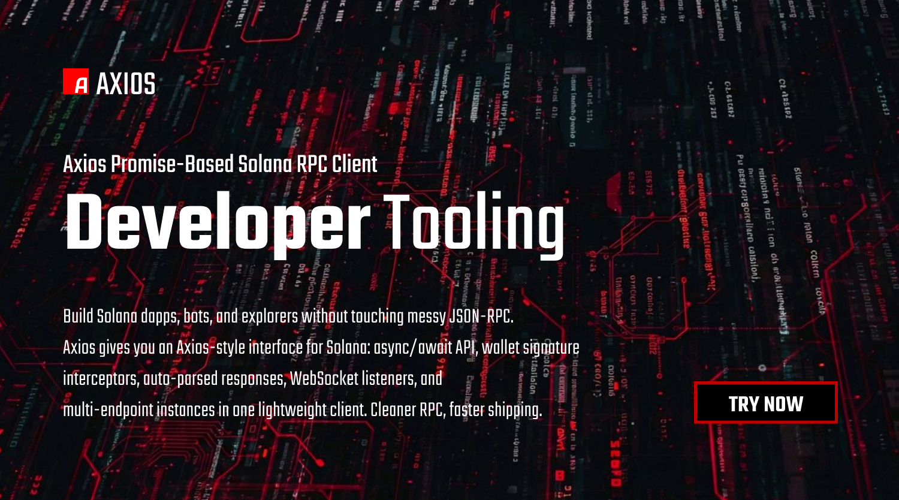

# Axios SDK Monorepo

Lightweight, modular TypeScript SDK inspired by Axios but designed for modern DApps.

**Features**

- Lightweight fetch-based engine
- Async/await API
- Request/response interceptors
- JSON auto-parsing
- Configurable instances (`Axios.create`)
- Plugin system for middleware and crypto signing
- TypeScript-first with shared types

**Monorepo Structure**

- `packages/core` - low-level request engine
- `packages/client` - public SDK API
- `packages/crypto` - signing plugins (Solana/EVM)
- `packages/utils` - shared utilities
- `packages/types` - shared TypeScript types
- `packages/examples` - Node, Browser, DApp examples

Installation

```powershell
pnpm install
```

Building

```powershell
pnpm build
```

Running Tests

```powershell
pnpm test
```

Quick Usage (Node)

```ts
import { Axios } from '@axios/client';

const api = Axios.create({ baseURL: 'https://httpbin.org', timeout: 10000 });
const resp = await api.get('/get');
console.log(resp.data);
```

Creating Instances

Use `Axios.create(config)` to create an instance with defaults. Each instance exposes `get`, `post`, `put`, `patch`, `delete`, and `interceptors`.

Writing Plugins

Plugins are simple objects with optional `request` and `response` interceptor functions.

```ts
api.use({
	request: async (cfg) => {
		// modify and return cfg
		return cfg;
	}
});
```

Crypto Signing

See `@axios/crypto` for `SolanaSigner` and `EvmSigner` examples which attach an `X-Signature` header to outgoing requests.

Error Handling

Errors are wrapped in `AxiosError` (from `@axios/types`) and include `.isAxiosError`, `.config`, `.code`, and optional `.response` when available.

DApp Integration

Use `@axios/crypto` plugins to sign outgoing payloads using wallet signers (Solana `signMessage` or EVM `signMessage`). Plugins attach signatures to headers so server-side verification can be performed.

More

See `packages/*/README.md` for package-specific usage and examples.

# axios-sdk
Lightweight HTTP client with async/await API, request interceptors, JSON handling, and configurable instances for modern apps.
